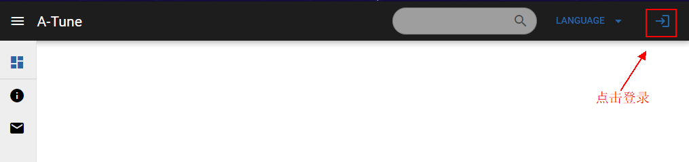
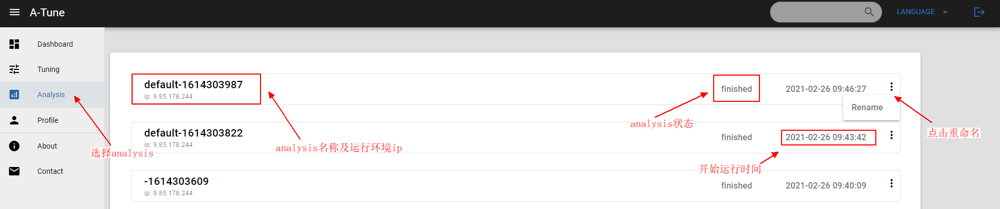
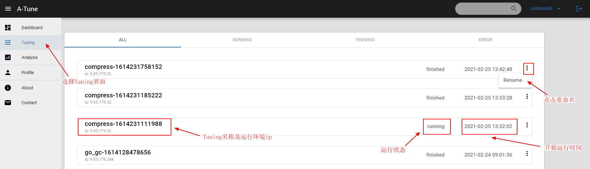

# A-Tune-UI使用手册

**版权所有 © 2021** **华为技术有限公司。**

您对“本文档”的复制，使用，修改及分发受知识共享(Creative Commons)署名—相同方式共享4.0国际公共许可协议(以下简称“CC BY-SA 4.0”)的约束。为了方便用户理解，您可以通过访问https://creativecommons.org/licenses/by-sa/4.0/ 了解CC BY-SA 4.0的概要 (但不是替代)。CC BY-SA 4.0的完整协议内容您可以访问如下网址获取：https://creativecommons.org/licenses/by-sa/4.0/legalcode。

## 前言

### 概述

A-Tune-UI是针对openEuler系统A-Tune项目开发的web UI，本文档介绍A-Tune-UI项目的的安装部署和使用方法，以指导用户快速了解并使用A-Tune-UI。

### 读者对象

本文档适用于使用openEuler系统并希望了解和使用A-Tune-UI的社区开发者、开源爱好者以及相关合作伙伴。

# 1 认识A-Tune-UI

## 1.1 简介

A-Tune是基于openEuler系统开发的性能自优化软件，通过在线静态调优和离线动态调优两种方式调节系统性能。

A-Tune延伸软件包含A-Tune-Collector和A-Tune-UI，A-Tune-Colloctor是用于系统各项数据的采集，详细信息可参考[A-Tune-Collector主页](https://gitee.com/openeuler/A-Tune-Collector)

A-Tune-UI则是基于A-Tune软件开发的网页UI，可以用于A-Tune调优效果展示、A-Tune历史调优数据查看、展示A-Tune-Collector采集的数据等功能，便于用户直观查看A-Tune对性能的提高或根据A-Tune-Collector采集到的数据分析当前环境的性能瓶颈。

# 2 安装与部署

本章介绍如何安装和部署A-Tune。

## 2.1 环境准备

建议用户安装openEuler系统，安装方法参考《openEuler 20.03 LTS 安装指南》。
确保环境已安装A-Tune并成功运行。

## 2.2 安装A-Tune-UI

本章介绍A-Tune-UI的安装模式和安装方法。

### 2.3.1 安装模式介绍

A-Tune支持代码安装和docker镜像安装：

- 代码安装

  用户下载A-Tune-UI代码仓并安装。

- docker镜像安装

  用户在安装docker后获取Dockerfile并通过docker安装。

### 2.3.2 代码安装及运行

通过源代码安装A-Tune-UI的操作步骤如下：

**步骤 1**   安装依赖包git。

```shell
# yum install -y git
```

**步骤 2**   下载源代码。

```shell
# git clone https://gitee.com/openeuler/A-Tune-UI.git
```

**步骤 3**   通过自动化脚本安装。

```shell
cd A-Tune-UI
sh -x install.sh
```

**步骤 4**   根据第三步返回值进行对应操作。

如果当前环境的ip与**步骤 3**中最终返回的ip相同，直接跳至**步骤 5**。
如果当前环境的ip与**步骤 3**中最终返回的ip不同，需通过以下命令替换A-Tune-UI/package.json文件中的ip地址（请将[YOUR_IP]替换为对应ip）：

```shell
sed -i "10s/-H .*/-H [YOUR_IP]\"/" package.json
```

注：
- 如需在非本地环境打开网页，此步骤非常关键，用户也可以直接打开package.json文件，确认第10行标注的ip是否为当前环境的ip。
- 非本地环境指ip不同的环境，例：
 - A-Tune-UI部署在ip为A的虚拟机上
 - 网页要在ip为B的物理机上通过firefox或其他浏览器打开
 在这种情况下，首先确认物理可以ping通虚拟机：`ping A`。确认无误后，在A-Tune-UI部署时，将package.json文件中第10行的IP替换为虚拟机的ip A。

**步骤 5**   替换engine后端ip。

将utils.js中的engineHost和enginePort替换为A-Tune部署时设置的engine的ip及端口号，如果已经成功部署A-Tune，可在/etc/atuned/engine.cnf文件中查看

```shell
# 请将[YOUR_ENGINE_HOST]和[YOUR_ENGINE_PORT]替换为具体ip和端口号
sed -i "s/ENGINE_HOST/[YOUR_ENGINE_HOST]/g" src/static/js/utils.js
sed -i "s/ENGINE_PORT/[YOUR_ENGINE_PORT]/g" src/static/js/utils.js
```

**步骤 6**   运行。

```shell
npm run start
```
回显中会附有UI界面打开使用的网址，通过此网址打开网页。

----结束

### 2.3.3 Dockerfile安装及运行

**准备**   使用Dockerfile安装前，请确保系统已安装docker。

openEuler系统可使用以下命令安装

```shell
yum install -y docker
```

**步骤 1**   获取Dockerfile文件。

使用wget工具获取：

```shell
wget https://gitee.com/openeuler/A-Tune-UI/raw/master/Dockerfile
```

若未安装wget工具，也可以直接在本地新建文件，文件名为`Dockerfile`，并复制代码到此文件中

**步骤 2**   生成atune-ui镜像。

```shell
docker build --network=host -t atune-ui:latest .
```

**步骤 3**   运行docker。

```shell
docker run -p <local_ip>:<local_port>:8080 -e ENG_HOST=<engine-host> -e ENG_PORT=<engine-port> atune-ui
```
运行成功后即可通过http://<local_ip>:<local_port>打开网页。

注：
- local_ip和local_port为当前运行环境的ip和未占用的端口，在运行成功后可以通过http://<local_ip>:<local_port>打开网页。
- engine-host和engine-port对应A-Tune engine.cnf中配置的ip和端口信息。

# 3 A-Tune-UI界面

当前主要开发完成的界面为Analysis界面及Tuning界面。

### 初始界面

在成功部署后首次打开网页，可以看到如下所示图片：  
  

使用数据库的用户点击右上角的login按钮，可跳转至login界面并设置admin账户，设置成功后可通过admin账户登录，登录后跳转至首页。
未使用数据库的用户点击右上角的login按钮会直接跳转至首页。
登录成功后界面：  
  

### Analysis界面

在右侧菜单栏可选择跳转至Analysis界面，此界面会显示通过atune-adm analysis命令执行的A-Tune离线静态调优的历史信息。
点击任意analysis可跳转至analysis详细信息界面。
**备注**   使用atune-adm collector命令采集数据得到的文件放在/var/atune_data/analysis路径下，即可在Analysis界面看到采集的信息。

  

### Tuning界面

在右侧菜单栏可选择跳转至Tuning界面，此界面会显示通过atune-adm tuning命令执行的A-Tune在线静态调优的历史信息。
点击任意tuning可跳转至tuning详细信息界面。



# 4 常见问题定位

### 问题1. 网页不显示内容

如果打开网页没有信息显示，可以查看：
1. 打开网页使用的ip是否为localhost，如果A-Tune-UI并未部署在本地却使用localhost打开页面，则无法显示任何信息，解决方法请参考本文档`2.3.2 代码安装及运行`的`步骤 4`

### 问题2. 无法访问此网址

如果打开网页时长时间加载，并在加载结束后显示“无法访问此网页”字样，可以查看：
1. 如果A-Tune-UI并非本地部署，请查看部署A-Tune-UI的环境是否已关闭防火墙，openEuler系统可使用`systemctl status firewalld`查看防火墙状态，并通过`systemctl stop firewalld`关闭防火墙。
2. 如果已部署A-Tune项目，请查看A-Tune是否开启了CA认证，具体操作如下：
  ```shell
  # 打开atuned.cnf文件
  vim /etc/atuned/atuned.cnf
  # 查看第59行rest_tls及66行engine_tls的值是否均为false
  # 如果不是，请设置成false后保存文件并退出
  rest_tls = false
  engine_tls = false
  
  # 打开engine.cnf文件
  vim /etc/atuned/engine.cnf
  # 查看第22行engine_tls的值是否为false
  # 如果不是，请设置成false后保存文件并退出
  engine_tls = false

  # 如果修改了以上文件，退出后需重启服务
  systemctl restart atuned
  systemctl restart atune-engine
  ```

### 问题3. analysis或tuning界面没有显示信息

如果能成功打开网页，但在跳转至analysis或tuning界面后，没有显示信息，可以：
- 如未使用数据库：
 1. 针对analysis界面，查看（部署A-Tune项目的环境的）/var/atune_data/analysis路径下是否存有.csv文件，如果没有可先尝试执行analysis命令，或将collector命令获取的数据文件移植此目录下。
 2. 针对tuning界面，查看（部署A-Tune项目的环境的）/var/atune_data/tuning/finished路径下是否存有.txt文件，如果没有可先尝试执行tuning命令。
- 如使用数据库：
 1. 针对analysis界面，请确认数据库collection_table表格已存在且不为空，如没有或为空请尝试执行analysis命令。
 2. 针对tuning界面，请确认数据库tuning_table表格已存在且不为空，如没有或为空请尝试执行tuning命令。
- 如文件路径下已存在对应文件，请确认utils.js文件中的engineHost及enginePort已修改，具体修改方法可参考本文的`2.3.2 代码安装及运行`的`步骤 5`。

> 如果以上信息无法解决您的问题，请在代码库中提交Issue，详细描述您遇到的问题并附上网页日志，网页日志可在页面点击`F12`打开查看。